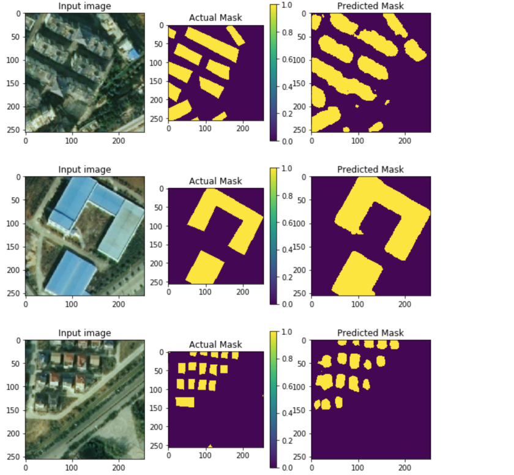
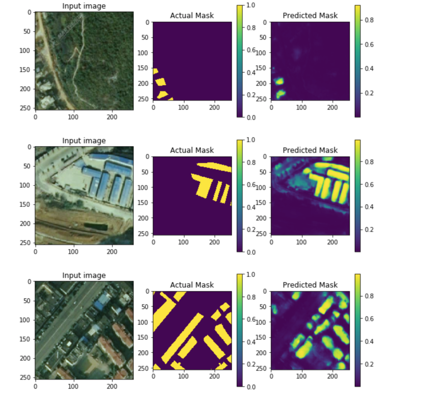
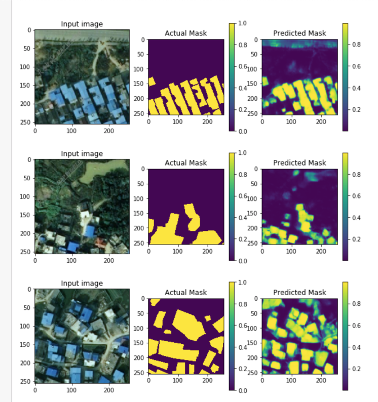

# 使用 u-net 进行遥感影像分割

我们基于一到两幅遥感影像（大约是 25000x15000 大小），人工标绘出上面的建筑物，将它们分割成 256x256 的小图片，样本库在 8000 左右。其中保留一小部分用来查看预测结果，这部分即没有参与训练，也没有用来验证。剩下的 80%用来训练，20%用来验证，训练了模型。

使用上面训练的模型，用来预测一部分保留的图片，预测结果非常依赖与建筑物的色彩，对于蓝色厂房最好，城区居民区的预测也可以接受。对于郊区的农房，它们的黑瓦和道路一样都是偏向于黑灰颜色，所以预测结果比较差。

## 为什么使用 U-Net

U-Net 本来用来进行生物医学领域内的图片分割，和在遥感影像上进行地物分割有相似之处，而且在训练样本较少的时候也有不错的分割效果。其他很多人在进行遥感影像分割时也采用了这个模型。

## 样本准备

首先找到显示效果较好的遥感影像，然后在地理处理软件里面人工将上面的建筑物描绘出来，作为 mask 图形。描绘出的是矢量图形，需要先把它转成像素图片，像素值 1 代表是建筑物，0 代表不是建筑物。遥感影像一般有三个波段，mask 只有一个波段。也就是，遥感影像的维度是 (x, y, z), mask 的维度是 (x, y)。

然后将影像和 mask 分割成 256x256 的小图片，准备训练。

## 训练样本，预测

训练：./skyunet/train.py
预测：./skyunet/predict.py
